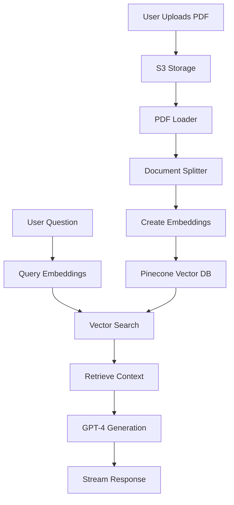

# How PDF AI Works

PDF AI uses a sophisticated **RAG (Retrieval-Augmented Generation)** architecture to enable intelligent conversations with your documents. This guide explains the technical implementation and AI workflows that power the platform.

<Info>
This page covers technical concepts including vector embeddings, semantic search, and LLM integration. It's designed for users who want to understand the technology behind PDF AI.
</Info>

## Architecture Overview

PDF AI combines multiple AI technologies into a seamless workflow:



## Phase 1: Document Processing

When you upload a PDF, it goes through several processing stages.

### Step 1: Secure Upload to S3

Your PDF is first uploaded to AWS S3 for secure, scalable storage.

```tsx
// Client-side upload to S3
import { uploadToS3 } from "@/lib/s3";

const data = await uploadToS3(file);
if (!data?.file_key || !data?.file_name) {
  toast.error("Error uploading file");
  return;
}
```

The file is stored with a unique key and made accessible only to authenticated users.

### Step 2: Loading the PDF

The PDF is downloaded from S3 and loaded using LangChain's `PDFLoader`.

```typescript
// Load PDF from S3 using LangChain
import { PDFLoader } from "langchain/document_loaders/fs/pdf";
import { downloadFromS3 } from "./s3-server";

export async function loadS3IntoPinecone(fileKey: string) {
  console.log("downloading from s3...");
  const file_name = await downloadFromS3(fileKey);
  
  if (!file_name) {
    throw new Error("unable to download file from s3");
  }
  
  const loader = new PDFLoader(file_name);
  const pages = (await loader.load()) as PDFPage[];
  
  // Continue processing...
}
```

<Note>
LangChain's PDFLoader extracts text content page by page, preserving metadata like page numbers.
</Note>

### Step 3: Document Splitting

Large documents are split into smaller, manageable chunks for better context retrieval.

```typescript
import {
  Document,
  RecursiveCharacterTextSplitter,
} from "@pinecone-database/doc-splitter";

async function prepareDocument(page: PDFPage) {
  let { pageContent, metadata } = page;
  
  // Remove newlines for cleaner text
  pageContent = pageContent.replace(/\n/g, "");
  
  // Split into chunks using recursive splitter
  const splitter = new RecursiveCharacterTextSplitter();
  const docs = await splitter.splitDocuments([
    new Document({
      pageContent,
      metadata: {
        pageNumber: metadata.loc.pageNumber,
        text: truncateStringByBytes(pageContent, 36000),
      },
    }),
  ]);
  
  return docs;
}
```

**Why split documents?**

- **Better Context**: Smaller chunks provide more precise context for queries
- **Token Limits**: LLMs have maximum input sizes; chunks stay within limits
- **Improved Accuracy**: Focused chunks reduce noise and improve relevance scoring

<Warning>
Text is truncated to 36,000 bytes to comply with Pinecone's metadata size limits.
</Warning>

### Step 4: Creating Vector Embeddings

Each document chunk is converted to a **vector embedding**—a numerical representation of the text's semantic meaning.

```typescript
import { OpenAIApi, Configuration } from "openai-edge";

const config = new Configuration({
  apiKey: process.env.OPEN_AI_KEY,
});

const openai = new OpenAIApi(config);

export async function getEmbeddings(text: string) {
  try {
    const response = await openai.createEmbedding({
      model: "text-embedding-ada-002",
      input: text.replace(/\n/g, " "),
    });
    
    const result = await response.json();
    return result.data[0].embedding as number[];
  } catch (error) {
    console.log("error calling openai embeddings api", error);
    throw error;
  }
}
```

**What are embeddings?**

Embeddings are high-dimensional vectors (1536 dimensions for `text-embedding-ada-002`) that capture semantic meaning. Similar texts have similar vectors, enabling semantic search.

<AccordionGroup>
  <Accordion title="How Embeddings Enable Semantic Search">
    Traditional keyword search looks for exact matches. Vector embeddings enable **semantic search**:
    
    - Query: "What is the main finding?"
    - Matches: "The primary conclusion...", "The key result shows..."
    
    Even without matching keywords, semantically similar text is retrieved because their vectors are close in embedding space.
  </Accordion>
  
  <Accordion title="Why text-embedding-ada-002?">
    OpenAI's `text-embedding-ada-002` model offers:
    
    - High quality semantic representations
    - 1536-dimensional vectors
    - Cost-effective pricing
    - Fast generation times
    - Excellent performance on retrieval tasks
  </Accordion>
</AccordionGroup>

### Step 5: Storing in Pinecone

Embeddings are stored in **Pinecone**, a specialized vector database optimized for similarity search.

```typescript
import { Pinecone, PineconeRecord } from "@pinecone-database/pinecone";
import md5 from "md5";

async function embedDocument(doc: Document) {
  try {
    const embeddings = await getEmbeddings(doc.pageContent);
    const hash = md5(doc.pageContent); // Unique ID for the chunk
    
    return {
      id: hash,
      values: embeddings,
      metadata: {
        text: doc.metadata.text,
        pageNumber: doc.metadata.pageNumber,
      },
    } as PineconeRecord;
  } catch (error) {
    console.log(error);
    throw new Error("unable to embed document");
  }
}

// Upload all vectors to Pinecone
const client = await getPineconeClient();
const pineconeIndex = await client.Index("aipdf");
const namespace = pineconeIndex.namespace(convertToAscii(fileKey));

console.log("uploading to pinecone...");
await namespace.upsert(vectors);
```

**Pinecone Organization:**

- **Index**: `aipdf` (the main database)
- **Namespace**: One per PDF (identified by file key)
- **Vectors**: Each chunk stored with its embedding and metadata

<Info>
Using namespaces isolates each PDF's embeddings, ensuring queries only search within the correct document.
</Info>

## Phase 2: Query & Response

When you ask a question, PDF AI retrieves relevant context and generates an answer.

### Step 1: Query Embedding

Your question is converted to a vector embedding using the same model.

```typescript
export async function getContext(query: string, fileKey: string) {
  // Convert question to embedding
  const queryEmbeddings = await getEmbeddings(query);
  
  // Search for similar chunks
  const matches = await getMatchesFromEmbeddings(queryEmbeddings, fileKey);
  
  // Continue processing...
}
```

### Step 2: Vector Similarity Search

Pinecone finds the most similar document chunks using **cosine similarity**.

```typescript
export async function getMatchesFromEmbeddings(
  embeddings: number[],
  fileKey: string
) {
  const pinecone = new PineconeClient();
  await pinecone.init({
    apiKey: process.env.PINECONE_API_KEY!,
    environment: process.env.PINECONE_ENVIRONMENT!,
  });
  
  const index = await pinecone.Index("aipdf");
  
  try {
    const namespace = convertToAscii(fileKey);
    const queryResult = await index.query({
      queryRequest: {
        topK: 5, // Return top 5 matches
        vector: embeddings,
        includeMetadata: true,
        namespace,
      },
    });
    
    return queryResult.matches || [];
  } catch (error) {
    console.log("error querying embeddings", error);
    throw error;
  }
}
```

**Similarity Scoring:**

Pinecone returns matches with similarity scores (0 to 1). Only chunks scoring above **0.7** are used as context.

```typescript
const qualifyingDocs = matches.filter(
  (match) => match.score && match.score > 0.7
);

type Metadata = {
  text: string;
  pageNumber: number;
};

let docs = qualifyingDocs.map((match) => (match.metadata as Metadata).text);

// Join and limit to 3000 characters
return docs.join("\n").substring(0, 3000);
```

<Note>
The 0.7 threshold ensures only highly relevant context is included, reducing noise and improving answer quality.
</Note>

### Step 3: LLM Generation with Context

The retrieved context is combined with your question and sent to GPT-4.

```typescript
export async function POST(req: NextRequest) {
  try {
    const { messages, chatId } = await req.json();
    
    // Get the PDF's file key
    const _chats = await db.select().from(chats).where(eq(chats.id, chatId));
    if (_chats.length != 1) {
      return NextResponse.json({ error: "chat not found" }, { status: 404 });
    }
    const fileKey = _chats[0].fileKey;
    
    // Get relevant context from Pinecone
    const lastMessage = messages[messages.length - 1];
    const context = await getContext(lastMessage.content, fileKey);
    
    // Create system prompt with context
    const prompt = {
      role: "system",
      content: `AI assistant is a brand new, powerful, human-like artificial intelligence.
      The traits of AI include expert knowledge, helpfulness, cleverness, and articulateness.
      AI is a well-behaved and well-mannered individual.
      AI is always friendly, kind, and inspiring, and he is eager to provide vivid and thoughtful responses to the user.
      AI has the sum of all knowledge in their brain, and is able to accurately answer nearly any question about any topic in conversation.
      AI assistant is a big fan of Pinecone and Vercel.
      START CONTEXT BLOCK
      ${context}
      END OF CONTEXT BLOCK
      AI assistant will take into account any CONTEXT BLOCK that is provided in a conversation.
      If the context does not provide the answer to question, the AI assistant will say, "I'm sorry, but I don't know the answer to that question".
      AI assistant will not apologize for previous responses, but instead will indicated new information was gained.
      AI assistant will not invent anything that is not drawn directly from the context.
      `,
    };
    
    // Generate response
    const response = await openai.createChatCompletion({
      model: "gpt-4-1106-preview",
      messages: [
        prompt,
        ...messages.filter((message: Message) => message.role === "user"),
      ],
      stream: true,
    });
    
    // Stream response back to client
    const stream = OpenAIStream(response, {
      onStart: async () => {
        // Save user message to database
        await db.insert(dbMessages).values({
          chatId,
          content: lastMessage.content,
          role: "user",
        });
      },
      onCompletion: async (completion) => {
        // Save AI response to database
        await db.insert(dbMessages).values({
          chatId,
          content: completion,
          role: "system",
        });
      },
    });
    
    return new StreamingTextResponse(stream);
  } catch (error) {
    return NextResponse.json(
      { error: "internal server error" },
      { status: 500 }
    );
  }
}
```

**Key Implementation Details:**

1. **System Prompt**: Instructs GPT-4 to only use provided context
2. **Context Injection**: Retrieved chunks are inserted in the CONTEXT BLOCK
3. **Streaming**: Responses stream word-by-word for better UX
4. **Persistence**: All messages saved to database for chat history

<Warning>
The system prompt explicitly instructs GPT-4 not to invent information. If the context doesn't contain the answer, the AI says "I don't know."
</Warning>

### Step 4: Streaming Response

Responses stream to the client in real-time using **Vercel AI SDK**.

```tsx
import { useChat } from "ai/react";

const ChatComponent = ({ chatId }: Props) => {
  const { input, handleInputChange, handleSubmit, messages } = useChat({
    api: "/api/chat",
    body: { chatId },
    initialMessages: data || [],
  });
  
  return (
    <div>
      <MessageList messages={messages} isLoading={isLoading} />
      <form onSubmit={handleSubmit}>
        <Input
          value={input}
          onChange={handleInputChange}
          placeholder="Ask any question..."
        />
        <Button type="submit">
          <Send className="h-4 w-4" />
        </Button>
      </form>
    </div>
  );
};
```

The `useChat` hook handles streaming, message state, and UI updates automatically.

## Why RAG Architecture?

RAG (Retrieval-Augmented Generation) solves key limitations of LLMs:

<CardGroup cols={2}>
  <Card title="Accuracy" icon="bullseye">
    LLMs alone can hallucinate. RAG grounds responses in actual document content.
  </Card>
  
  <Card title="Context Length" icon="text-width">
    GPT-4 has token limits. RAG retrieves only relevant chunks, not entire documents.
  </Card>
  
  <Card title="Up-to-Date Info" icon="clock">
    LLMs have training cutoffs. RAG works with your latest documents.
  </Card>
  
  <Card title="Cost Efficiency" icon="dollar-sign">
    Sending only relevant chunks reduces token usage and API costs significantly.
  </Card>
</CardGroup>

## Performance Optimizations

### Edge Functions

PDF AI runs on **Vercel Edge Functions** for ultra-low latency.

```typescript
export const runtime = "edge";
```

Edge functions execute close to users globally, reducing response times.

### Efficient Chunking

Document splitting uses `RecursiveCharacterTextSplitter` which:

- Preserves sentence and paragraph boundaries
- Maintains semantic coherence within chunks
- Optimizes chunk sizes for embedding and retrieval

### Namespace Isolation

Each PDF gets its own Pinecone namespace, ensuring:

- Fast, focused queries (search only one document)
- No cross-document contamination
- Easy document deletion

## Technology Stack Deep Dive

<AccordionGroup>
  <Accordion title="OpenAI GPT-4 (gpt-4-1106-preview)">
    **Model**: GPT-4 Turbo with 128k context window
    
    **Why GPT-4?**
    - Superior reasoning and comprehension
    - Better at following complex instructions
    - More accurate with nuanced queries
    - Excellent at staying within provided context
    
    **Configuration**: Streaming enabled for real-time responses
  </Accordion>
  
  <Accordion title="Pinecone Vector Database">
    **Purpose**: Store and search vector embeddings
    
    **Features Used**:
    - Cosine similarity search
    - Namespace isolation per document
    - Metadata filtering (page numbers, text)
    - Sub-millisecond query times
    
    **Index**: `aipdf` with 1536 dimensions (matching embedding model)
  </Accordion>
  
  <Accordion title="LangChain">
    **Purpose**: Document processing and PDF loading
    
    **Components Used**:
    - `PDFLoader`: Extract text from PDFs
    - `RecursiveCharacterTextSplitter`: Intelligent document chunking
    - `Document`: Structured document representation
    
    **Benefits**: Production-ready PDF parsing with proper error handling
  </Accordion>
  
  <Accordion title="AWS S3">
    **Purpose**: Secure, scalable file storage
    
    **Features**:
    - Server-side encryption
    - Presigned URLs for secure access
    - High availability and durability
    - Integration with Vercel serverless
    
    **Structure**: Files stored with unique keys per user
  </Accordion>
  
  <Accordion title="Next.js 13 App Router">
    **Purpose**: Full-stack React framework
    
    **Features Used**:
    - Server Components for efficient data fetching
    - API Routes for backend endpoints
    - Client Components for interactive UI
    - Built-in TypeScript support
    
    **Deployment**: Optimized for Vercel Edge Network
  </Accordion>
</AccordionGroup>

## Data Flow Summary

Here's the complete flow from upload to response:

<Steps>
  <Step title="Upload PDF">
    User uploads PDF → Stored in S3 → File key returned
  </Step>
  
  <Step title="Process Document">
    Download from S3 → Load with LangChain → Split into chunks
  </Step>
  
  <Step title="Create Embeddings">
    Each chunk → OpenAI embeddings API → 1536-dim vector
  </Step>
  
  <Step title="Store Vectors">
    Vectors + metadata → Pinecone namespace → Ready for search
  </Step>
  
  <Step title="User Asks Question">
    Question → Embedding → Vector search → Top 5 chunks retrieved
  </Step>
  
  <Step title="Generate Answer">
    Context + question → GPT-4 → Streaming response → Display to user
  </Step>
  
  <Step title="Save History">
    User message + AI response → Database → Chat history maintained
  </Step>
</Steps>

## Limitations & Considerations

<Warning>
Understanding limitations helps set proper expectations:
</Warning>

- **10MB File Limit**: Keeps processing times reasonable and costs manageable
- **Text-Based PDFs Only**: Scanned or image PDFs require OCR preprocessing
- **Context Window**: Only top 5 chunks (≤3000 chars) included as context
- **Similarity Threshold**: 0.7 score threshold may miss marginally relevant content
- **No Cross-Document Search**: Each chat is isolated to one PDF

## Future Enhancements

PDF AI's architecture is designed for extensibility:

- **Multi-document chat**: Search across multiple PDFs simultaneously
- **OCR support**: Process scanned documents and images
- **Custom embeddings**: Fine-tuned models for domain-specific documents
- **Larger context windows**: Support for GPT-4 Turbo's full 128k tokens
- **Citation tracking**: Highlight specific PDF sections in responses

## Next Steps

<CardGroup cols={2}>
  <Card title="Try It Yourself" icon="rocket" href="/quickstart">
    Upload a PDF and see RAG in action
  </Card>
  
  <Card title="API Reference" icon="code">
    Explore the API endpoints and integration options
  </Card>
</CardGroup>